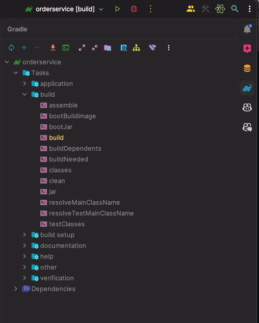

# Order Service Implemented with Hexagonal Architecture.

## Pasos para Configurar y Ejecutar el Proyecto

### 1. Clonar el Repositorio

### 2. Configurar el Repositorio con Java Corretto 17 (preferente)
Asegúrate de tener Java Corretto 17 instalado y configurado en tu entorno. (Puede utilizarse otra versión de JAVA 17)

### 3 Configurar el IDE
Configura tu IDE con un perfil de ejecución local, si no puedes ver el botón de RUN, `OrderserviceApplication`,  contiene el método `main` de la aplicación.

### 5. Ejecutar el Servicio Completo
Si deseas ejecutar el servicio completo, sigue estos pasos:

1. Asegúrate de tener Docker instalado y en funcionamiento.
2. Abre una terminal y navega al directorio del proyecto.
3. Ejecuta el siguiente comando para iniciar los servicios necesarios, incluyendo una instancia de MySQL para pruebas:

    docker-compose up
Si solo deseas ejecutar las pruebas unitarias, sigue estos pasos:

### 5.1 Ejecutar las Pruebas Unitarias
Si solo deseas ejecutar las pruebas unitarias, sigue estos pasos:

1. Abre la pestaña de Gradle en el lado derecho de tu IDE.
2. Navega a `orderservice/tasks/build`.
3. Selecciona el comando `build` y haz doble clic para ejecutar las pruebas. 

Las pruebas están definidas en la clase `OrderServiceTest`, ubicada en `src/test/java/com.test.orderservice/OrderServiceTest`.

